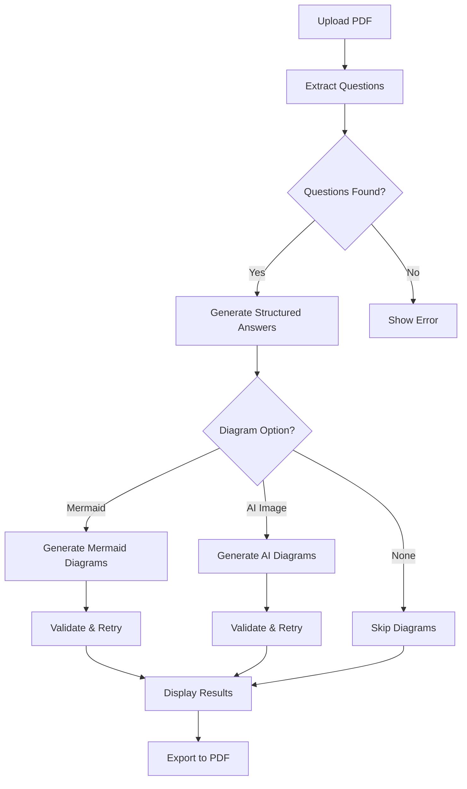

# 🚀 Gemini PDF Q&A Processor

<div align="center">


**An advanced AI-powered application that extracts questions from PDFs and generates comprehensive, structured answers with intelligent diagram generation.**

[Features](#-features) • [Demo](#-demo) • [Installation](#-installation) • [Usage](#-usage) • [API Keys](#-api-keys) • [Configuration](#-configuration) • [Contributing](#-contributing)

</div>

---

## 📋 Table of Contents

- [Overview](#-overview)
- [Features](#-features)
- [Demo](#-demo)
- [Installation](#-installation)
- [Usage](#-usage)
- [API Keys](#-api-keys)
- [Configuration](#-configuration)
- [Technical Architecture](#-technical-architecture)
- [Troubleshooting](#-troubleshooting)
- [Contributing](#-contributing)
- [License](#-license)
- [Acknowledgments](#-acknowledgments)

---

## 🌟 Overview

The **Gemini PDF Q&A Processor** is a cutting-edge Streamlit application that revolutionizes how you handle question-answering workflows. Upload a PDF containing questions, and watch as advanced AI generates professional, structured answers complete with visual diagrams.

### Why Choose This Tool?

- ✅ **Intelligent Question Detection** - Advanced regex patterns accurately extract questions from complex PDFs
- 🤖 **Powered by Gemini 2.5 Flash Lite** - Leverages Google's latest AI model for superior answer quality
- 🎨 **Multiple Diagram Options** - Choose between Mermaid flowcharts or AI-generated visual diagrams
- 📊 **Structured Formatting** - Answers organized with summaries, key points, and takeaways
- 📄 **Professional PDF Reports** - Export everything to beautifully formatted PDF documents
- 🔄 **Retry & Validation** - Built-in error handling ensures successful diagram generation
- 🎯 **Customizable Output** - Select between concise or detailed answer styles

---

## ✨ Features

### 🧠 Advanced Question Extraction

- **Smart Pattern Matching**: Detects numbered questions (1., Q1, Question 1) and questions ending with `?`
- **Duplicate Filtering**: Automatically removes duplicate questions while preserving order
- **Context Preservation**: Extracts up to 15 relevant questions with full context

### 💬 Intelligent Answer Generation

#### Two Answer Styles:

**Concise Mode** 📝
```
✓ 2-3 sentence summaries
✓ Key points in bullet format
✓ Clear takeaways
✓ Quick, scannable content
```

**Detailed Mode** 📚
```
✓ Comprehensive overviews
✓ In-depth explanations
✓ Real-world applications
✓ Structured components
✓ Professional summaries
```

### 🎨 Diagram Generation

#### Option 1: Mermaid Diagrams
- **Flowcharts** for processes and workflows
- **Sequence diagrams** for interactions
- **Class diagrams** for structures
- **Automatic validation** with retry logic
- **PNG export** via multiple conversion services

#### Option 2: AI-Generated Diagrams
- **Professional visual diagrams** using AI image generation
- **Multiple fallback services**: HuggingFace, DeepAI, QuickChart
- **Automatic validation** and quality checks
- **Retry mechanism** for failed generations

### 📊 Beautiful UI/UX

- 🌙 **Dark gradient theme** with glassmorphic cards
- ⚡ **Animated loaders** with progress indicators
- 📈 **Real-time statistics** dashboard
- 🎯 **Intuitive sidebar** configuration
- 💫 **Smooth transitions** and hover effects

### 📄 Professional PDF Export

- 📑 **Structured layout** with headers and footers
- 🖼️ **Embedded diagrams** (both Mermaid and AI-generated)
- 📊 **Summary statistics** and metadata
- 🎨 **Color-coded sections** for readability
- 📝 **Proper text encoding** for special characters

---

## 🎥 Demo

### Screenshot Preview
```
┌─────────────────────────────────────────────────────────┐
│  🚀 Gemini PDF Q&A Processor                            │
│  Advanced AI-powered question answering                  │
├─────────────────────────────────────────────────────────┤
│                                                          │
│  ⚙️ Configuration          │  📄 Upload PDF             │
│  • API Keys                │  • Extract Questions        │
│  • Answer Style            │  • Generate Answers         │
│  • Diagram Type            │  • Create Diagrams          │
│                            │  • Download Report          │
└─────────────────────────────────────────────────────────┘
```

### Workflow Diagram


---

## 🔧 Installation

### Prerequisites

- Python 3.8 or higher
- pip package manager
- Git (optional)

### Step 1: Clone the Repository
```bash
git clone https://github.com/yourusername/gemini-pdf-qa-processor.git
cd gemini-pdf-qa-processor
```

### Step 2: Create Virtual Environment (Recommended)
```bash
# Windows
python -m venv venv
venv\Scripts\activate

# macOS/Linux
python3 -m venv venv
source venv/bin/activate
```

### Step 3: Install Dependencies
```bash
pip install -r requirements.txt
```

### Dependencies List
```txt
streamlit>=1.28.0
google-generativeai>=0.3.0
fpdf>=1.7.2
PyPDF2>=3.0.0
requests>=2.31.0
Pillow>=10.0.0
```

---

## 🚀 Usage

### Quick Start

1. **Start the application:**
```bash
streamlit run app.py
```

2. **Configure in sidebar:**
   - Enter your Gemini API key
   - (Optional) Add HuggingFace token for enhanced AI diagrams
   - Select answer detail level (Concise/Detailed)
   - Choose diagram type

3. **Upload PDF:**
   - Click "Browse files" or drag & drop
   - Supported format: PDF only

4. **Process:**
   - Click "🚀 Extract Questions & Generate Answers"
   - Watch the animated progress indicators
   - Wait for completion (typically 1-3 minutes)

5. **Review & Download:**
   - Browse questions and answers in the first tab
   - View generated diagrams
   - Download comprehensive PDF report

### Advanced Configuration

#### Answer Customization
```python
# In the sidebar, select:
answer_type = "Concise"  # For quick, scannable answers
# OR
answer_type = "Detailed"  # For comprehensive explanations
```

#### Diagram Options
```python
# Choose your preferred diagram type:
diagram_option = "No Diagrams"           # Skip diagram generation
diagram_option = "Mermaid Diagrams"      # Generate flowcharts (free)
diagram_option = "AI-Generated Diagrams" # Generate visual diagrams
```

---

## 🔑 API Keys

### Gemini API Key (Required)

1. Visit [Google AI Studio](https://aistudio.google.com/app/apikey)
2. Sign in with your Google account
3. Click "Create API Key"
4. Copy the key and paste it in the sidebar

**Free Tier:** 60 requests per minute

### HuggingFace Token (Optional)

1. Visit [HuggingFace Settings](https://huggingface.co/settings/tokens)
2. Create new token with "Read" access
3. Copy and paste in sidebar for enhanced AI diagram quality

**Note:** Without HuggingFace token, the app uses free fallback services (DeepAI, QuickChart)

---

## ⚙️ Configuration

### Environment Variables (Optional)

Create a `.env` file:
```env
GEMINI_API_KEY=your_gemini_api_key_here
HUGGINGFACE_TOKEN=your_huggingface_token_here
```

### Customization Options

#### Modify Question Extraction
```python
# In extract_questions_from_pdf()
questions = questions[:15]  # Change limit (default: 15)
```

#### Adjust Diagram Settings
```python
# In generate_mermaid_with_context()
complexity = "simple and clear"  # Adjust diagram complexity
```

#### Change Answer Length
```python
# In generate_structured_answer()
context[:2000]  # Concise mode context length
context[:3000]  # Detailed mode context length
```

---

## 🏗️ Technical Architecture

### System Components
```
┌─────────────────────────────────────────────────────────┐
│                     Frontend Layer                       │
│  • Streamlit UI with custom CSS                         │
│  • Interactive components and animations                 │
└─────────────────┬───────────────────────────────────────┘
                  │
┌─────────────────▼───────────────────────────────────────┐
│                  Processing Layer                        │
│  • PDF text extraction (PyPDF2)                         │
│  • Question detection (Regex patterns)                   │
│  • Context management                                    │
└─────────────────┬───────────────────────────────────────┘
                  │
┌─────────────────▼───────────────────────────────────────┐
│                    AI Layer                             │
│  • Gemini 2.5 Flash Lite (Answers)                      │
│  • Structured prompt engineering                         │
│  • Multi-retry validation logic                          │
└─────────────────┬───────────────────────────────────────┘
                  │
┌─────────────────▼───────────────────────────────────────┐
│                Diagram Generation                        │
│  Path 1: Mermaid    │  Path 2: AI Images                │
│  • Code generation  │  • HuggingFace SD                 │
│  • Syntax validation│  • DeepAI fallback                │
│  • PNG conversion   │  • QuickChart fallback            │
└─────────────────┬───────────────────────────────────────┘
                  │
┌─────────────────▼───────────────────────────────────────┐
│                   Export Layer                           │
│  • PDF generation (FPDF)                                │
│  • Image embedding                                       │
│  • Text encoding handling                                │
└─────────────────────────────────────────────────────────┘
```

### Key Algorithms

#### Question Extraction Algorithm
```python
1. Extract full text from all PDF pages
2. Apply numbered question regex pattern
3. Apply question mark pattern
4. Clean and normalize text
5. Filter by length and relevance
6. Remove duplicates
7. Limit to top 15 questions
```

#### Diagram Generation with Retry
```python
1. Check if question needs diagram
2. Generate diagram code/image (Attempt 1)
3. Validate syntax/quality
4. If invalid: Retry with adjusted parameters
5. If still invalid: Generate fallback
6. Convert to PNG/embed in output
```

---

## 🐛 Troubleshooting

### Common Issues

#### 1. "No questions found in PDF"

**Causes:**
- PDF contains images instead of text
- Questions not properly formatted
- Scanned PDF without OCR

**Solutions:**
```bash
# Ensure PDF has extractable text
# Questions should be numbered (1., Q1) or end with ?
# Use OCR tool if PDF is scanned
```

#### 2. "API Key Error"

**Causes:**
- Invalid or expired API key
- Rate limit exceeded
- Network connectivity issues

**Solutions:**
```bash
# Verify API key at https://aistudio.google.com
# Check rate limits (60 req/min for free tier)
# Test internet connection
```

#### 3. "Diagram Generation Failed"

**Causes:**
- All diagram services down
- Invalid Mermaid syntax
- HuggingFace quota exceeded

**Solutions:**
```bash
# Try different diagram option
# Check service status
# Wait and retry after a few minutes
# Use "No Diagrams" option as fallback
```

#### 4. "PDF Export Error"

**Causes:**
- Special characters in text
- Large diagram images
- Memory constraints

**Solutions:**
```python
# App auto-handles encoding issues
# Reduces image quality if needed
# Falls back to simple text PDF
```

### Debug Mode

Enable detailed logging:
```python
# Add to app.py
import logging
logging.basicConfig(level=logging.DEBUG)
```

---

## 🤝 Contributing

We welcome contributions! Here's how you can help:

### Contribution Guidelines

1. **Fork the repository**
2. **Create a feature branch**
```bash
   git checkout -b feature/AmazingFeature
```
3. **Commit your changes**
```bash
   git commit -m 'Add some AmazingFeature'
```
4. **Push to branch**
```bash
   git push origin feature/AmazingFeature
```
5. **Open a Pull Request**

### Code Standards

- Follow PEP 8 style guide
- Add docstrings to functions
- Include comments for complex logic
- Test before submitting

### Feature Requests

Have an idea? Open an issue with the `enhancement` label!

**Possible enhancements:**
- [ ] Support for multiple PDF uploads
- [ ] Excel/Word document support
- [ ] Custom prompt templates
- [ ] Multi-language support
- [ ] Answer quality scoring
- [ ] Comparison mode for multiple answers
- [ ] Cloud storage integration

---

## 📜 License

This project is free to use 

## 🙏 Acknowledgments

### Technologies Used

- **[Streamlit](https://streamlit.io/)** - Frontend framework
- **[Google Gemini](https://deepmind.google/technologies/gemini/)** - AI model
- **[PyPDF2](https://pypdf2.readthedocs.io/)** - PDF processing
- **[FPDF](http://www.fpdf.org/)** - PDF generation
- **[Mermaid](https://mermaid.js.org/)** - Diagram syntax
- **[HuggingFace](https://huggingface.co/)** - AI image generation
- **[DeepAI](https://deepai.org/)** - Fallback image service
- **[QuickChart](https://quickchart.io/)** - Diagram rendering

### Special Thanks

- Google AI team for Gemini API
- Streamlit community for excellent documentation
- Contributors and testers

---

## 📞 Contact & Support

### Get Help

- 📧 **Email**: support@example.com
- 💬 **Discord**: [Join our server](#)
- 📱 **Twitter**: [@YourHandle](#)
- 🐛 **Issues**: [GitHub Issues](https://github.com/yourusername/gemini-pdf-qa-processor/issues)

### Project Links

- 🏠 **Homepage**: [Visit Website](#)
- 📖 **Documentation**: [Full Docs](#)
- 🎥 **Tutorial**: [Watch Video](#)
- ⭐ **Star on GitHub**: [Give us a star!](https://github.com/yourusername/gemini-pdf-qa-processor)

---

## 📊 Project Statistics

<div align="center">


</div>

---

## 🎯 Roadmap

### Version 1.0 (Current)
- ✅ Basic PDF question extraction
- ✅ Gemini AI integration
- ✅ Mermaid diagram generation
- ✅ AI image diagrams
- ✅ PDF export functionality

### Version 1.1 (Coming Soon)
- ⏳ Batch processing multiple PDFs
- ⏳ Custom answer templates
- ⏳ Export to Word/Markdown
- ⏳ Answer quality metrics

### Version 2.0 (Future)
- 🔮 Multi-language support
- 🔮 Voice-to-text for questions
- 🔮 Interactive diagram editing
- 🔮 Cloud storage integration
- 🔮 Collaborative features

---

<div align="center">

### ⭐ If you find this project useful, please consider giving it a star!

**Built with ❤️ by Piyush**

[⬆ Back to Top](#-gemini-pdf-qa-processor)

</div>
